<h1 align="center">Parth Rajput</h1>

  <b>Full-Stack Developer</b> &nbsp;·&nbsp; <b>Flutter Developer</b> &nbsp;·&nbsp; <b>AI/ML Enthusiast</b> 
  Gujarat, India &nbsp;·&nbsp; MCA

 

<code>parth@github ~ $ ./contributions.sh</code>

verified GitHub contribution activity

 

<code>parth@github ~ $ whoami</code>

<table>
<tr>
<td valign="top"></td>
<td valign="top"></td>
</tr>
</table>

 

<code>parth@github ~ $ cat about.md</code>

 

I'm a Full-Stack and Flutter developer who builds SaaS products, AI-powered
applications, and practical software for real business problems.

I work across the whole stack — React and Next.js on the front end, Node.js and
Express behind it, Flutter for mobile and desktop, and PostgreSQL, MongoDB or
SQLite underneath. Most of my time goes into **multi-tenant business software**
and into wiring **AI APIs into products people actually use**.

I care about the unglamorous parts: tenant isolation, auth that holds up,
migrations that don't lose data, and interfaces a non-technical shop owner can
run all day without a manual.

 

<code>parth@github ~ $ ls projects/</code>

 

| Project | What it is | Stack |
| :--- | :--- | :--- |
| **Laundry POS**   *(Sahya)* | Multi-tenant POS and billing platform for laundry businesses — role-aware dashboards, tenant isolation, invoicing, inventory, expenses, loyalty and subscriptions, plus a Flutter desktop client. | Next.js 15 · React 19 · Express · TypeScript · Prisma · PostgreSQL · Flutter · Docker |
| **GestureOS 2.0** | Real-time hand-gesture cursor control — drive the mouse, click and scroll from a webcam, with primary-hand locking, safety gates and physics-based cursor acceleration. | Python · MediaPipe · OpenCV · PyAutoGUI · PyQt6 |
| **YogaAI Coach** | Real-time yoga pose detection and correction. Tracks 33 body landmarks, computes joint angles, and gives corrective feedback with stability and flexibility scoring. Runs fully on-device. | Python · MediaPipe · OpenCV · PyQt6 · Pandas |
| **Sahya Sales Panel**   [`live demo ↗`](https://sahya-sales-panel.vercel.app) | Enterprise sales-operations panel: leads and imports, campaigns, deals, AI voice agents, live-call monitoring and team performance dashboards. | Next.js (App Router) · React · Recharts |
| **TUG Lounge**   [`live demo ↗`](https://tug-henna.vercel.app) | Booking platform for a next-gen gaming venue — arena availability, session booking, tournaments, galleries and an admin panel. | React 19 · TypeScript · Vite · Tailwind v4 · Framer Motion · TanStack Query |
| **Gujarat Tourism**   [`live demo ↗`](https://gujarat-tourism-eta.vercel.app) | MERN tourism and tour-booking platform with a separate REST API service — listings, destinations, JWT auth and booking flows. | React · Express · MongoDB · Mongoose · JWT |

These are private repositories — client and commercial work — so only the deployed demos are linked. Happy to walk through the code or architecture on request.

 

<code>parth@github ~ $ cat stack.txt</code>

 

| | |
| :--- | :--- |
| **Languages** | JavaScript · TypeScript · Python · Dart · Java · PHP · SQL |
| **Frontend** | React · Next.js · Vite · Tailwind CSS · Framer Motion |
| **Backend** | Node.js · Express · REST APIs · JWT / RBAC |
| **Mobile & Desktop** | Flutter · Dart |
| **Databases** | PostgreSQL · MongoDB · SQLite · Prisma |
| **AI** | OpenAI · Gemini · Claude · Grok · DeepSeek · MediaPipe · OpenCV |
| **Infrastructure** | Cloudflare · Firebase · Docker · Vercel · Nginx · GitHub Actions |

 

<code>parth@github ~ $ cat building.md</code>

 

- **Sahya / Laundry POS** — growing the multi-tenant POS into a deployable product: billing, subscriptions and a Flutter Windows client for counter staff.
- **AI-powered applications** — building product features on top of OpenAI, Gemini and Claude APIs rather than bolting a chatbot onto a form.
- **Computer-vision tooling** — on-device pose and gesture work in Python, where the whole pipeline has to run in real time on ordinary hardware.
- **Business software** — POS, billing and operations panels for people who need software that just works during a shift.

 

<code>parth@github ~ $ ./connect.sh</code>

  <a href="https://www.linkedin.com/in/parthrajput16/">LinkedIn</a>
  &nbsp;·&nbsp;
  <a href="https://github.com/IGC-ATOM">GitHub</a>

  Open to full-stack, Flutter and AI-integration work.

 

  
    The heatmap is regenerated daily from real GitHub data by
    <a href="./.github/workflows/update-profile-art.yml">a scheduled workflow</a>.
    Portrait and card are SVGs built by <a href="./scripts">the scripts in this repo</a>.
  

